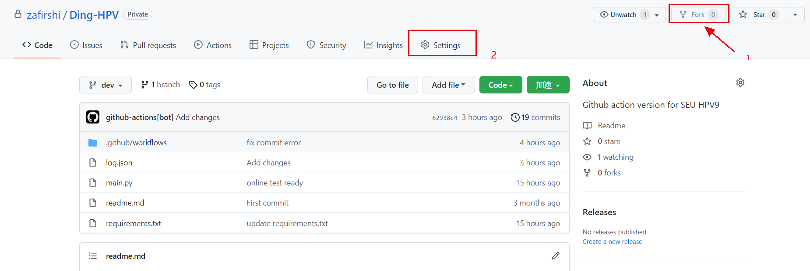
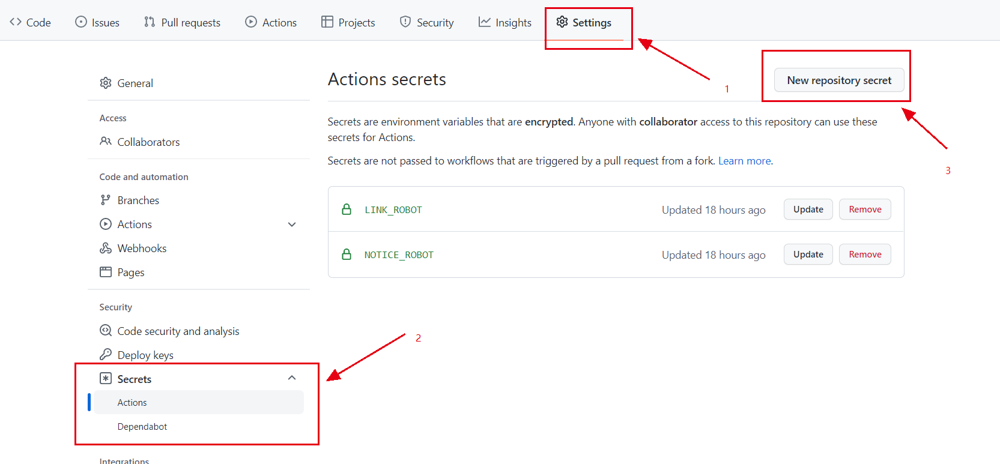
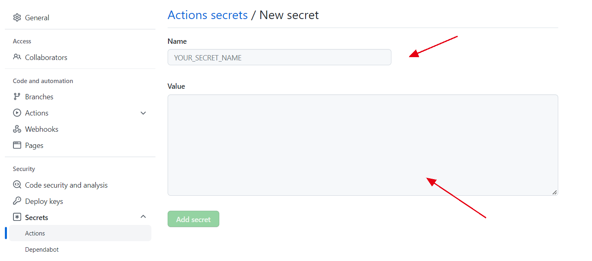
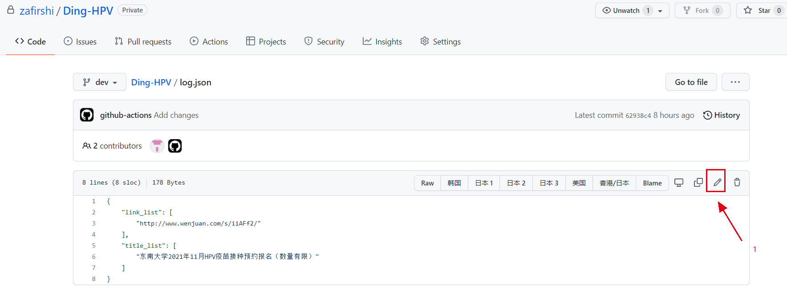
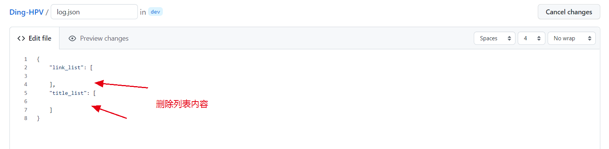
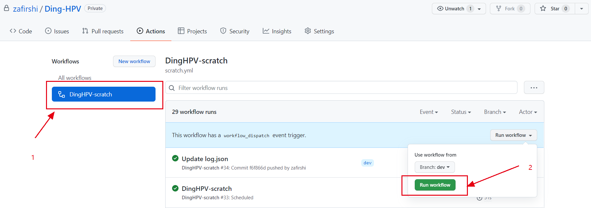
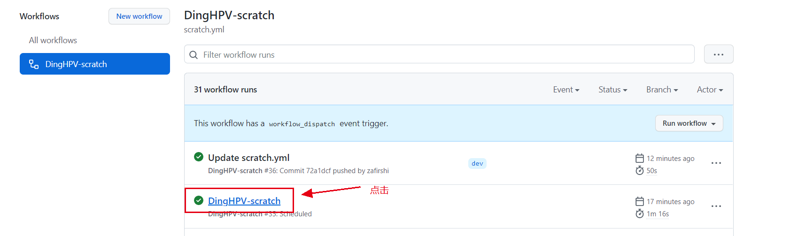
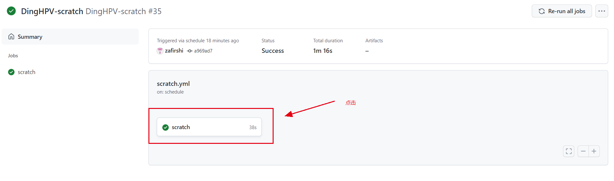
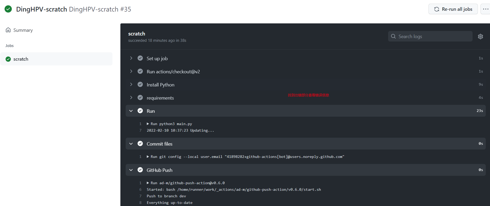

# Ding-HPV-dev


据说好像不用在网上预约了，学生的话校医院就可以(?)，那这个脚本岂不是没人用了hhh，anyway 学会了python爬虫+GitHub action的工作流（狗头）

话说回来，要是大家都不用脚本倒也是件好事，希望HPV-9早日普及，女生蛮不容易的

那这个项目就停止维护了，祝好！

---
**这部分readme针对dev分支**

---

## 1. 项目说明

本项目使用Python爬虫，爬取[SEU校医院](https://hospital.seu.edu.cn/)的HPV疫苗填写问卷，通过钉钉群机器人发送提醒消息和问卷链接

借助Github action自动化部署，无需本地服务器，实现在8:00~22:00每半个小时定时抓取网页

## 2. 使用设置

### 2.1 机器人配置

使用本项目前，需要配置钉钉的群聊机器人，具体配置方法如下：

PC端钉钉 > 新手体验群 > 群设置 > 智能群助手 > 添加机器人 > 自定义

需要添加两个机器人：名字分别为`notice_robot`和`link_robot`

1. notice_robot：安全设置选择`自定义关键字`，填`HPV`，然后下一步复制Webhook。
2. link_robot:安全设置选择`自定义关键字`，填两个`问卷`和`链接`，然后下一步复制Webhook。

> 注意！手机端钉钉无法设置自定义机器人，请使用PC端钉钉

### 2.2 代码配置

- **Fork & Setting**s：将本项目fork至自己的仓库中，点击Settings



- **添加secrets变量**：找到Settings > 左侧Security > Secrets > Actions，在Action secrets面板中点击`New repository secret`



​		新建变量，取名分别为`LINK_ROBOT`和`NOTICE_ROBOT`



将两个钉钉机器人Webhook的后面token，分别复制在Value文本框中`NOTICE_ROBOT`对应notice_robot的token、`LINK_ROBOT`对应link_robot的token

- **修改log.json文件**：点开log.json文件，删除link_list和title_list中的内容，并提交PR





​		下滑至下方点击`commit changes`

- **手动初始化**：切换到Action选项面板，可以看到刚刚更新json后产生的`Update log.json`工作流，手动执行workflow



- **Flag**：提醒消息成功推送 & 代码中的los.json文件被成功更新，即配置成功

  如果出现错误，点击DingHPV-scratch查看runner中的scratch job，点开出错的子步骤，复制错误信息，提交issue

  

  

  

### 2.3 运行逻辑

代码运行后，会先发送两条消息提醒，以用作初始化。

每隔一段时间后，爬取网页问卷数据，与log.json文件中存储好的`title_list`和`link_list`对比，如果**新增问卷链接** 或者**旧问卷标题被更新** ，

就会触发机器人提醒

> Github Action的执行时间较程序严格设计的时间有延时

### 2.4 可自定义修改的部分

- **抓取程序单次触发时间**

修改.gituhb/workflow/scratch.yml

```yaml
on:
  workflow_dispatch:
  push:
    branches: [ dev ]
  pull_request:
    branches: [ dev ]
  schedule:
  # 设定程序在UTC时间0：00-14：00,每30min，周日-周六，执行
    - cron: 0,30 0-14 * * 0-6
```

> crontab时间五个占位符的含义：
>
> 1. Minute [0,59]
> 2. Hour [0,23]
> 3. Day of the month [1,31]
> 4. Month of the year [1,12]
> 5. Day of the week ([0,6] with 0=Sunday)

## 3. Todo

- [ ] 爬取数据的时候，可以使用ip代理伪装

- [x] ~~链接应该都是在工作时间8：00~18：00更新，可以定时段抓取~~（在workflow的yaml文件中添加schedule时间已解决）

- [ ] 其他待测试情况

## 4. 参考链接

- Github Action官方说明文档：https://docs.github.com/en/actions/learn-github-actions/understanding-github-actions

- 程序执行修改log.json后，自动同步更新仓库中的文件

  【Github Push】：https://github.com/marketplace/actions/github-push

  【相关问题】：https://github.community/t/can-github-actions-directly-edit-files-in-a-repository/17884

- 修复Tree clean的Bug：https://github.community/t/ignore-working-tree-clean/193304

- 参考项目【GlaDOS自动签到】：https://github.com/sicilly/glados-checkin-1

